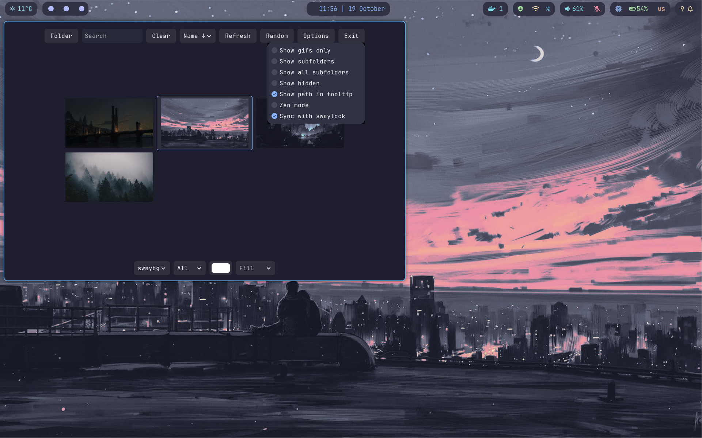

# Waypaper

> [!NOTE]
> This is a fork of [Waypaper](https://github.com/anufrievroman/waypaper) by Anufriev Roman.
> Please consider visiting the original repository to star and support the project.

What was added:
- Synchronization of wallpaper with `swaylock` lockscreen

## About

GUI wallpaper setter for Wayland and Xorg window managers. It works as a frontend for popular wallpaper backends like `swaybg`, `swww`, `wallutils`, `hyprpaper`, `mpvpaper`, `xwallpaper` and `feh`. See [demo](https://www.youtube.com/watch?v=O9OL7iH_KVY) and [documentation](https://anufrievroman.gitbook.io/waypaper).

## Features

- Vim keys
- Supports GIF animations (with `swww` or `mpvpaper`)
- Supports videos (with `mpvpaper`)
- Supports multiple monitors (with `swww` or `swaybg` or `hyprpaper` or `mpvpaper`)
- Works on Wayland (with `swww` or `swaybg` or `hyprpaper` or `wallutils` or `mpvpaper`)
- Works on Xorg (with `feh`, `xwallpaper` or `wallutils`)
- Restores wallpaper after restart (`waypaper --restore`)
- Synchronizes wallpapers with `swaylock` lockscreen
- Fast and minimal (315 kB)

## Installation

Install at least one of the backends and Waypaper, which works as a frontend.

### 1. Install a backend

Install a preferred backend from your package manager: [swww](https://github.com/Horus645/swww) or [swaybg](https://github.com/swaywm/swaybg) or [hyprpaper](https://github.com/hyprwm/hyprpaper) on Wayland or [xwallpaper](https://github.com/stoeckmann/xwallpaper) or [feh](https://github.com/derf/feh) on Xorg or [mpvpaper](https://github.com/GhostNaN/mpvpaper) or [wallutils](https://github.com/xyproto/wallutils) on both.

### 2. Install Waypaper

Install `waypaper`, which is available in different repositories:

#### On all distributions

`pipx install waypaper`

If `pipx` is not found, you first need to install `pipx` from your package manager, it's sometimes called `python-pipx`.

#### On Arch-based distributions

`yay -S waypaper`

The [waypaper](https://aur.archlinux.org/packages/waypaper) package and unstable developer package [waypaper-git](https://aur.archlinux.org/packages/waypaper-git) are available in AUR, thanks to *metak*. Please upvote to support the project.

#### On NixOS

The `waypaper` package is available thanks to Basil Keeler.

#### On OpenSUSE

Users of OpenSUSE [reported issue with installation](https://github.com/anufrievroman/waypaper/issues/30) via `pipx install waypaper`. This can be resolved by installing the `python313-pycairo-devel` and `python313-gobject-devel` packages first.

#### On Fedora

Waypaper is available in an external repository owned by Solopasha. You can add this repository as `sudo dnf copr enable solopasha/hyprland` and install as `sudo dnf install waypaper`.

### Dependencies

- `swww` or `swaybg` or `xwallpaper` or `feh` or `wallutils` or `hyprpaper` or `mpvpaper`
- gobject python library (it might be called `python-gobject` or `python3-gi` or `python3-gobject` in your package manager.)
- `python-imageio`
- `python-imageio-ffmpeg`
- `python-screeninfo`
- `python-platformdirs`
- `swaylock` or `swaylock-effects` (only if you want to synchronize wallpaper with lockscreen)

## Usage

`waypaper` command will run GUI application.

To restore your wallpaper after restart, add `waypaper --restore` to [your WM startup config](https://anufrievroman.gitbook.io/waypaper/usage).

## Documentation

- [CLI options](https://anufrievroman.gitbook.io/waypaper/usage#cli-options)
- [Configuration](https://anufrievroman.gitbook.io/waypaper/configuration)
- [Keybindings](https://anufrievroman.gitbook.io/waypaper/keybindings)
- [Troubleshooting](https://anufrievroman.gitbook.io/waypaper/troubleshooting)
- [Automatically changing wallpaper](https://anufrievroman.gitbook.io/waypaper/usage#automatically-changing-wallpaper)
- [Set wallpaper after restart](https://anufrievroman.gitbook.io/waypaper/usage)

## Contribution

Feel free to propose PR and suggest the improvements. I'll appreciate help with packaging for various distributions. If you wish to contribute with translation into your language, please see the `translations.py` file. Here are a few guiding principles for contribution:

- Please do not apply automatic code formatting tools on the entire code base.
- Please propose features separately, don't combine unrelated changes into one PR.
- For big changes, please open an issue first to discuss, otherwise PR might be declined.
- If the changes involve hundreds of lines of code, probably something is wrong. Most things can be done with small adjustments.

## Support

If you like this project, please consider starring the [original repository](https://github.com/anufrievroman/waypaper) to support the development.
